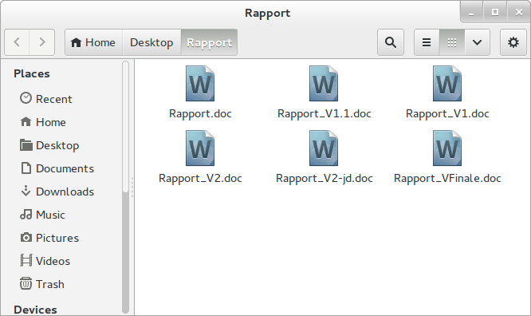
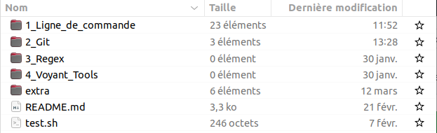
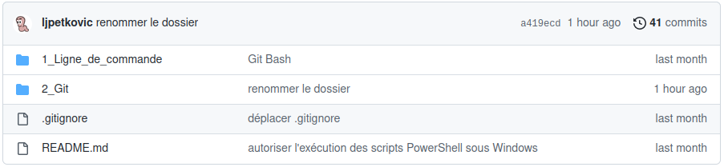
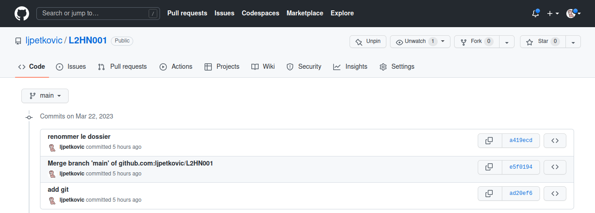
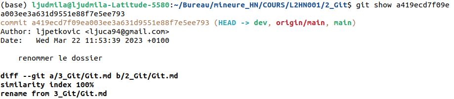
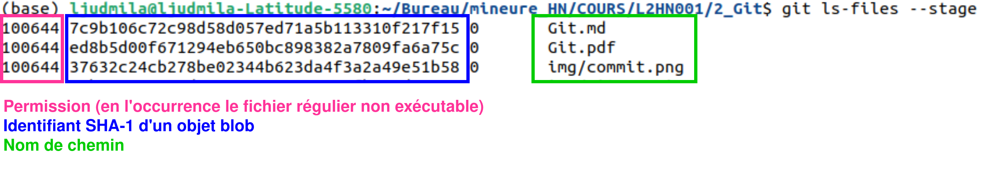
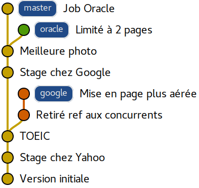
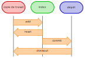

  <style>
  section {
    background-color: white;
    color: black;
    font-family: system-ui !important;
  }


  h1 {
    color: DarkBlue;
  }

  

  h2 {
    color: DarkBlue;
  }

  h3 {
    color: DarkBlue;
  }

  h4 {
    color: DarkBlue;
  }

  h5 {
    color: DarkBlue;
  }

  h6 {
    color: DarkBlue;
    font-size: 30px;
    font-weight:normal;
  }

  blockquote {
    background: #ffedcc;
    border-left: 10px solid #d1bf9d;
    margin: 1.5em 10px;
    padding: 0.5em 10px;
  }
  blockquote:before{
    content: unset;
  }

  blockquote:after{
    content: unset;
  }

  small-text {
      font-size: 0.7rem;
    }

  smaller-text {
      font-size: 0.5rem;
    }

  .center {
   display: block;
     margin-left: auto;
   margin-right: auto;
     width: 50%;
  }

.container {
  display: grid;
  grid-template-columns: 0.68fr 1fr;
}

    .container-side {
      display: inline-flex;
      text-align: center;
    }


    #content {
          position: relative;
      }
      #content img {
          position: absolute;
          top: -600px;
          right: 0px;
      }

  </style>

</div> 

  <div class="column">
    
  </div>
 <div class="row">
  <div class="column">
      <figure>
    
      </figure>
  </div>


  <!-- _class: lead -->

  ## Cultures numériques avancées

  #### Git : outil de versionnement du code

  ###### Ljudmila PETKOVIC

<small-text><a href="mailto:ljudmila.petkovic@sorbonne-nouvelle.fr">`ljudmila.petkovic@sorbonne-nouvelle.fr`</a></small-text>

  <br>

  

  <small-text> 

Cultures numériques avancées (L2HN001)
Licence *Sciences du langage*, mineure « Humanités numériques »
Paris, le 22 mars 2024, année 2023-2024

  </small-text>

<smaller-text>*Diapositives adaptées de l'[IUT Lyon 1](https://perso.liris.cnrs.fr/pierre-antoine.champin/enseignement/intro-git/)* *et de [Thibault Clérice](https://github.com/PonteIneptique/cours-git)*</smaller-text>

<!--<smaller-text>*Diapositives adaptées de [Simon Gabay](https://github.com/gabays/Fondamentaux/blob/main/Lignes_de_commandes/DistRead_1_2.pdf) et de [Simone Rebora](https://github.com/ABC-DH/EnExDi2022/tree/main/materials/1_KnowYourComputer/slides)*.</smaller-text>-->

<div style="position:relative; top:-220px; left:0px; margin-left:860px; margin-right:0px; font-size:14px;">
  Source :  <a href="https://kinsta.com/fr/blog/commandes-linux/">Diaz, 2023.</a>
</div>


---

## Problème 1

<p align="center">
  
</p>


* la version la plus à jour est-elle `Rapport.doc` ou `Rapport_VFinale.doc` ?
* et si on avait aussi `Rapport_VFinale1.doc` et `Rapport_VFinale2.doc` ?
* les versions n’apparaissent pas dans l’ordre (`1.1`, `1`, `2`)
* la version `2-jd` vient elle avant ou après la version `2` ?

---

## Problème 1.1

<p align="center">
  
</p>


* les versions de l’image sont-elles numérotées indépendamment, ou par rapport aux versions de la page ?
* nécessité de renommer les fichiers pour visualiser une ancienne version (pour que les liens fonctionnent)

---

## Besoins des utilisateur·trice·s

Les utilisateur·trice·s ont donc besoin de :

- comprendre les versions
- pouvoir revenir en arrière, avoir une « trace » des documents
- pouvoir avoir une collaboration simple

---

## Gestion des versions

- la gestion des versions est un travail fastidieux et méthodique
- les humains ne sont pas doués pour ce genre de travail
- laissons cela à l’ordinateur et concentrons-nous sur la partie du travail où nous sommes meilleurs que l’ordinateur

→ VCS (*Version Control System*)

---

<p align="right">
  
</p>


## [Git](https://git-scm.com/) : un outil de versionnage 

- plusieurs applications :
  - gestion de code source pour les projets logiciels 
  - rédaction de la documentation
  - création d'un site web
- permet un travail collaboratif, grâce à la :
  - facilité d’échange
  - traçabilité
  - gestion des conflits

---

# Notions de base

---

## Dépôt

- (angl. *repository*, abbr. *repo*) 
- répertoire et entrepôt virtuel d'un projet qui permet d'enregistrer les versions des documents et d'y accéder au besoin 
- il contient un répertoire (caché) **`.git`** avec toutes les données dont Git a besoin pour gérer l’historique des données

Vous pouvez démarrer un dépôt Git de deux manières :

1. transformer le répertoire existant en dépot Git (initialiser le dépôt) : `git init`

2. *cloner* un dépôt Git existant depuis un serveur distant sur votre machine, p. ex. : 

   ```bash
   git clone https://github.com/ljpetkovic/L2HN001.git
   ```

---

## Télécharger vs. *cloner* le dépôt Git

* lorsque vous **téléchargez** le dépôt, vous ne récupérez que les fichiers-source sans le répertoire `.git`, donc vous n'avez pas le dépôt Git fonctionnel
  * toutes vos modifications ne resteront que dans votre répertoire local 
  * impossible de synchroniser le dépôt local avec le dépôt distant

* lorsque vous **clonez**, vous obtenez une copie de l'historique des modifications et c'est un dépôt Git fonctionnel
  * vous pouvez synchroniser le dépôt local avec le dépôt distant


---

## Copie de travail

(angl. *working copy*) 

* les fichiers effectivement présents dans le répertoire géré par Git (en local)
  * **NB** : leur état peut être différent de celui enregistré dans le *dépôt distant* (*cf.* slide 24).

<p align="left">
  
      
</p>

<small-text>&nbsp;&nbsp;&nbsp;&nbsp;&nbsp;&nbsp;&nbsp;&nbsp;&nbsp;&nbsp;&nbsp;&nbsp;&nbsp;&nbsp;&nbsp;&nbsp;&nbsp;&nbsp;&nbsp;&nbsp;&nbsp;Figure 1. Copie de travail.</small-text><small-text>&nbsp;&nbsp;&nbsp;&nbsp;&nbsp;&nbsp;&nbsp;&nbsp;&nbsp;&nbsp;&nbsp;&nbsp;&nbsp;&nbsp;&nbsp;&nbsp;&nbsp;&nbsp;&nbsp;&nbsp;Figure 2. Dépôt distant (sur [GitHub](https://github.com/), serveur centralisé pour Git).</small-text>

---

## *Commit*

Pour qu'une modification soit enregistrée, il faut que cela soit explicité (≠ p. ex. Google Drive, où les modifications sont automatiquement enregistrées).

* ces modifications archivées sont appelées *commits*
  * <small-text>« commiter » : enregistrer la nouvelle version d'un fichier sur un système de gestion de configuration<small-text>
* les commits possèdent une date, un auteur, une description textuelle et un identifiant SHA-1 (valeur *hash*)

- les commits peuvent comporter plusieurs fichiers

- les fichiers qui ont subi des modifications doivent y être ajoutés explicitement

  - pour commiter les modifications indexées

    ```bash
    git commit -m "Ceci est mon premier commit"
    ```

---

## *Commit* 

* l’historique d’un projet est une séquence de « photos » (commits), contenant l’état de tous les fichiers du projet

* pour afficher la liste des commits en ligne de commande (historique) : `git log`

  ```bash
  (base) ljudmila@ljudmila-Latitude-5580:~/Bureau/mineure_HN/COURS/L2HN001/2_Git$ git log
  commit a419ecd7f09ea003ee3a631d9551e88f7e5ee793 (HEAD -> main, origin/main)
  Author: ljpetkovic <ljuca94@gmail.com>
  Date:   Wed Mar 22 11:53:39 2023 +0100
  
      renommer le dossier
  
  commit e5f0194cb8065a08c7d690721640c04b450aa86b
  Merge: ad20ef6 4a3a98f
  Author: ljpetkovic <ljuca94@gmail.com>
  Date:   Wed Mar 22 11:52:48 2023 +0100
  
      Merge branch 'main' of github.com:ljpetkovic/L2HN001
  ...
  ```

---

## *Commit* 

Liste des commits sur GitHub :

<p align="center">
  
</p>


---

## *Commit*

* afficher le détail d’un commit particulier : `git show <identifiant_du_commit>`

  <p align="center">
    
  </p>

---

## Index

* espace temporaire contenant les modifications (création, modification ou suppression des fichiers) prêtes à être « commitées » 

* fichier binaire (stocké dans le répertoire `.git`) contenant une liste triée de noms de chemin, chacun avec des autorisations et l'identifiant SHA1 d'un objet *blob* (angl. *binary large object*) ; 

La commande `git ls-files --stage` montre le contenu de l'index :

<p align="center">
  
</p>


---

## Index

* ajouter un fichier dans l'index (ajouter des modifications) : `git add test.txt`
  * ajouter tous les fichiers modifiés : `git add -A` 

* retirer un fichier de l'index : `git reset test.txt`
* voir la liste des modifications réalisées (différence entre l'état archivé et actuel)
  * résumé : `git status` 
  * détails de changements : `git diff`

---

### Résumé des modifications

```bash
(base) ljudmila@ljudmila-Latitude-5580:~/Bureau/mineure_HN/COURS/L2HN001/2_Git$ git status
Sur la branche main
Votre branche est à jour avec 'origin/main'.

Modifications qui ne seront pas validées :
  (utilisez "git add/rm <fichier>..." pour mettre à jour ce qui sera validé)
  (utilisez "git restore <fichier>..." pour annuler les modifications dans le répertoire de travail)
	modifié :         Git.pdf
	supprimé :        img/commit.png

Fichiers non suivis:
  (utilisez "git add <fichier>..." pour inclure dans ce qui sera validé)
	../1_Ligne_de_commande/Bash_recap.html
	...

aucune modification n'a été ajoutée à la validation (utilisez "git add" ou "git commit -a")
```

---

### Détails des changements

```bash
(base) ljudmila@ljudmila-Latitude-5580:~/Bureau/mineure_HN/COURS/L2HN001/2_Git$ git diff
diff --git a/1_Ligne_de_commande/commandes/coucou_2.sh b/1_Ligne_de_commande/commandes/coucou_2.sh
deleted file mode 100644
index 36532ad..0000000
--- a/1_Ligne_de_commande/commandes/coucou_2.sh
+++ /dev/null
@@ -1,3 +0,0 @@
-#!/bin/bash
-nom="Michel"
-echo "Coucou $nom"
diff --git a/2_Git/Git.md b/2_Git/Git.md
index 7c9b106..27795a3 100644
--- a/2_Git/Git.md
+++ b/2_Git/Git.md
@@ -15,7 +15,6 @@ section {
   color: black;
 }
 
-
 h1 {
   color: DarkBlue;
 }
@@ -98,10 +97,6 @@ Paris, le 21 mars 2023
 
 ---
:
```

---

## Branches

Dans certaines situations, on peut souhaiter faire cohabiter et évoluer *plusieurs* versions divergentes du même projet.

Ces versions peuvent parfois converger à nouveau (mais pas forcément).

Une branche est la *lignée* (généalogique) de commits, à laquelle on a donné un nom.

* par commodité, la version-maître est nommée `main` ou `master`, et les variantes `dev`, `test` ou autre.

---

## Branches

#### Exemple : CV

Pour un CV, on souhaite avoir :

- une version « maître » que l’on maintient à jour,
- des variantes pour chaque demande d’emploi, adaptées en fonction de l’employeur visé.


---

## Branches

<p align="center">
  
</p>


**NB :** L’historique n’a plus une structure linéaire, mais *arborescente* (ce qui justifiera la métaphore de la « branche »).

---

## Branches

* créer une nouvelle branche : `git branch [nom de la branche]` (ex. *dev*)

* obtenir la liste des branches courantes : `git branch`

  * l'étoile indique sur quelle branche nous travaillons (en l'occurrence *main*)

    ```bash
    (base) ljudmila@ljudmila-Latitude-5580:~/Bureau/mineure_HN/COURS/L2HN001/2_Git$ git branch dev
    (base) ljudmila@ljudmila-Latitude-5580:~/Bureau/mineure_HN/COURS/L2HN001/2_Git$ git branch
      dev
    * main
    ```

* pour basculer sur une autre branche : `git checkout [nom de la branche]` 

Si vous relancez `git branch`, vous verrez que la branche courante a changé.

---

## Trois états de fichiers 

1. ***modifié*** : le fichier a été modifié, mais il n'a pas encore été ajouté à un commit
2. ***indexé*** : le fichier a été ajouté à un commit, mais le commit n'a pas été finalisé avec un message → *staging area*, *stage* ou *index*
3. ***commité*** : les modifications du fichier ont été enregistrées

<p align="center">
  
    
</p>


---

## Dépôt distant

Un dépôt distant (angl. *remote repository*) est un dépôt Git, similaire à un dépôt local, mais accessible à distance via une URL.

* exemple :  https://github.com/ljpetkovic/L2HN001

Un dépôt local peut être lié à un dépôt distant ; Git offre des fonctionnalités pour copier des commits de l’un à l’autre.

---

## Avantages de l'utilisation d'un dépôt distant

- sauvegarder le projet (fichiers + historique) 
- conservation de l’historique (nominatif) des fichiers (qui a fait quoi ?)
- synchroniser le projet avec un serveur distant
- travailler sur plusieurs machines
- rendre le projet accessible à d’autres personnes
- travailler sur un projet publié par quelqu’un d’autre
- collaborer à plusieurs sur un projet 
- possibilité de retour en arrière
- fusion des modifications lors du travail collaboratif
- visualiser les changements au cours du temps

---

## *Push*

Publier les commits sur un serveur donné : `git push` 

---

## Prérequis pour la mise en œuvre

1. créer un compte sur GitHub

2. installer GitHub Desktop (interface graphique)

* [tutoriel](https://docs.github.com/en/desktop/installing-and-authenticating-to-github-desktop/installing-github-desktop)

---

  ## Références

<ul style="font-size: 20px">
    <li><b>Champin, P.-A. & Cordier, A. </b>Introduction à GIT. <a href="https://perso.liris.cnrs.fr/pierre-antoine.champin/enseignement/intro-git/">https://perso.liris.cnrs.fr/pierre-antoine.champin/enseignement/intro-git/</a></li>
    <li><b>Clérice, T.</b> (<i>2021</i>). Cours pour apprendre Git et ses bonnes pratiques [<i>dépôt GitHub</i>]. <a href="https://github.com/PonteIneptique/cours-git">https://github.com/PonteIneptique/cours-git</a></li>
</ul>

