  

 

  

    
  

 

  

      <figure>
    
      </figure>
  

  <!-- _class: lead -->

  ## Cultures numériques avancées

  #### GitHub et GitHub Desktop

  ###### Ljudmila PETKOVIC

<small-text><a href="mailto:ljudmila.petkovic@sorbonne-nouvelle.fr">`ljudmila.petkovic@sorbonne-nouvelle.fr`</a></small-text>

   

  

  <small-text> 

Cultures numériques avancées (L2HN001)
Licence *Sciences du langage*, mineure « Humanités numériques »
Paris, le 29 mars 2024, année 2023-2024

  </small-text>

<!--<smaller-text>*Diapositives adaptées de l'[IUT Lyon 1](https://perso.liris.cnrs.fr/pierre-antoine.champin/enseignement/intro-git/)* *et de [Thibault Clérice](https://github.com/PonteIneptique/cours-git)*</smaller-text>-->

<smaller-text>*Diapositives adaptées de [O'clock](https://oclock.io/tuto-github-lutiliser) et de [GitHub, Inc.](https://docs.github.com/fr/desktop/overview/getting-started-with-github-desktop)*</smaller-text>

  Source :  <a href="https://kinsta.com/fr/blog/commandes-linux/">Diaz, 2023.</a>

---

## [Git](https://git-scm.com/) : un outil de versionnage (rappel)

- plusieurs applications :

  - gestion de code source1 pour les projets logiciels 

    1 texte qui présente les instructions composant un programme sous une forme lisible, telles qu'elles ont été écrites dans un langage de programmation.

  - rédaction de la documentation

  - création d'un site web

- permet un travail collaboratif, grâce à la :

  - facilité d’échange
  - traçabilité
  - gestion des conflits

---

## Git

* Git fonctionne en créant une copie locale (angl. *clone*) du projet sur un ordinateur
* on peut apporter des modifications à ces fichiers 
* on peut enregistrer chaque modification sous forme de  « commit »
  * les commits servent de points de contrôle dans l’historique du projet
  * un commit est accompagné d’un message expliquant les changements effectués
  * ces messages permettent de comprendre ce qui a été modifié à chaque étape
    * un bel avantage pour le suivi de projet

---

## GitHub

* plateforme de développement collaboratif basée sur Git
* permet aux développeurs de partager, gérer et collaborer sur des projets
* facilite la gestion du code source et la collaboration entre les membres
* fonctionnalités avancées pour suivre les problèmes / demandes de modifications
* référence dans le domaine
* transparence, productivité et collaboration dans le développement logiciel
* peut fusionner les modifications, ce qui facilite le travail en collaboration

---

## 1️⃣ Inscription sur GitHub

1. Accédez à https://github.com/.

2. Cliquez sur **Sign Up** (« s'inscrire »).

3. Suivez les invites pour créer votre compte personnel.

   

     
   

---

### GitHub – côté utilisateur·trice

  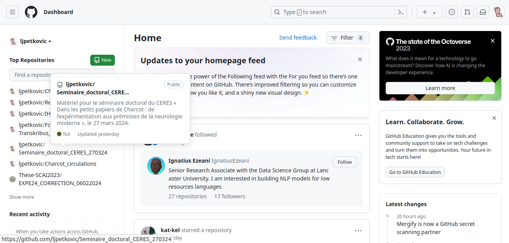

---

### GitHub Desktop

* application *open source*1 gratuite qui permet d’utiliser du code hébergé sur GitHub ou sur d’autres services d’hébergement Git (p. ex. [GitLab](https://about.gitlab.com/))

  1 code source que l'on rend disponible gratuitement pour qu'il puisse être modifié et redistribué, dans un contexte de développement communautaire ([Office québécois de la langue française, 2002](https://archive.wikiwix.com/cache/index2.php?url=https%3A%2F%2Fvitrinelinguistique.oqlf.gouv.qc.ca%2Fredirection%2Fficheuid%2F8362923#federation=archive.wikiwix.com&tab=url)).

* effectue des commandes Git : 

  * validation / spécification (angl. *commit*) des modifications
  * envoi (angl. *push*) de modifications, dans une GUI

* alternative à l'utilisation de la ligne de commande

---

## 2️⃣ Télécharger et installer GitHub Desktop (Windows)

* [tutoriel](https://docs.github.com/en/desktop/installing-and-authenticating-to-github-desktop/installing-github-desktop?platform=windows)

  
  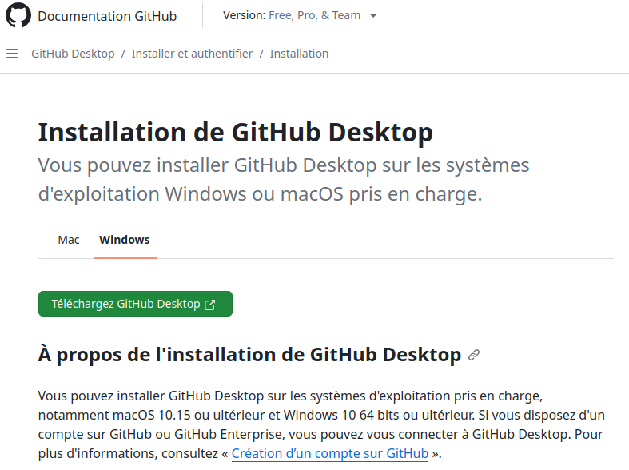      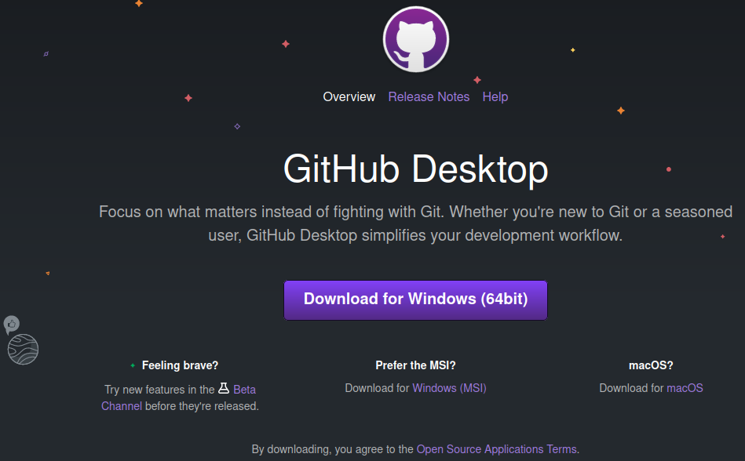

---

##  2️⃣ Télécharger et installer GitHub Desktop (Mac)

* [tutoriel](https://docs.github.com/en/desktop/installing-and-authenticating-to-github-desktop/installing-github-desktop?platform=mac)

  
  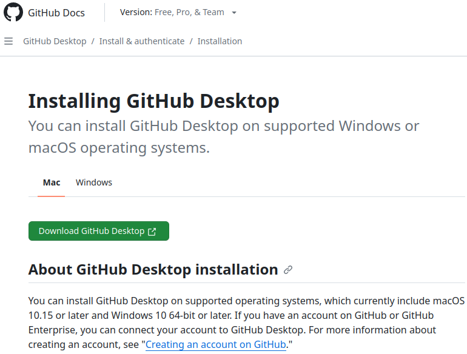      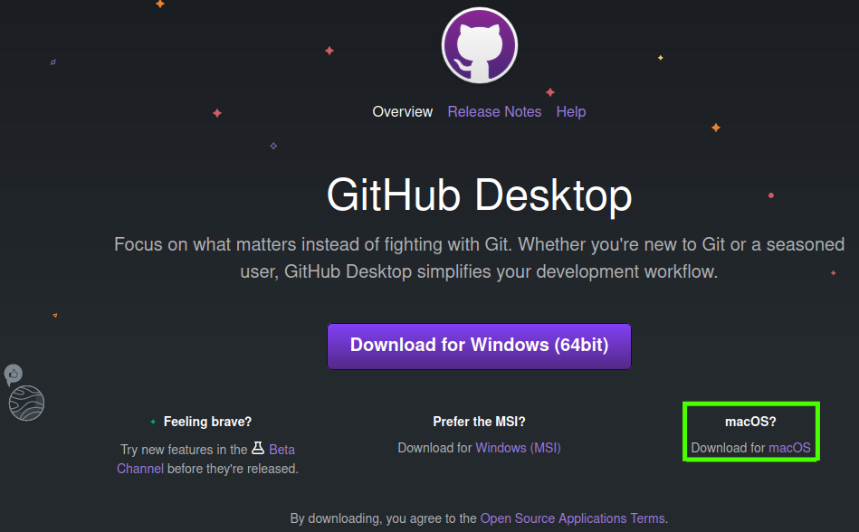

---

## 2️⃣ Télécharger et installer GitHub Desktop

1. Visitez la [page](https://desktop.github.com/) de téléchargement de GitHub Desktop.     
2. Cliquez sur **Télécharger** (Windows ou Mac).
3. Dans le dossier `Téléchargements` de votre ordinateur, double-cliquez sur le fichier d'installation, p. ex. :
   1. `GitHubDesktopSetup-x64.exe` pour Windows 
   2. `GitHubDesktop-x64.zip` pour Mac.     
4. Lancer GitHub Desktop une fois l'installation terminée.

---

### GitHub Desktop – interface graphique

  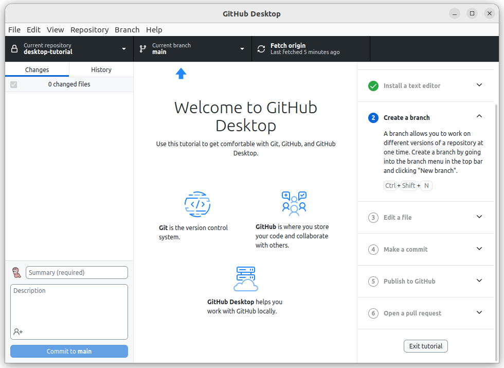

---

##  3️⃣ Authentification

* une fois GitHub Desktop installé, authentifiez-vous avec votre compte GitHub

* permet de vous connecter à des dépôts distants sur GitHub

  

    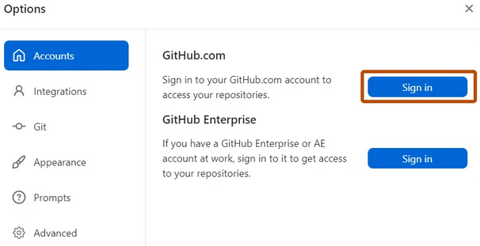
  

---

## 4️⃣ Configuration et personnalisation de GitHub Desktop

* vous pouvez configurer l'application pour l'adapter au mieux à vos besoins

  * connecter / supprimer des comptes GitHub, choisir un éditeur de texte ou un interpréteur de commandes par défaut...

  

    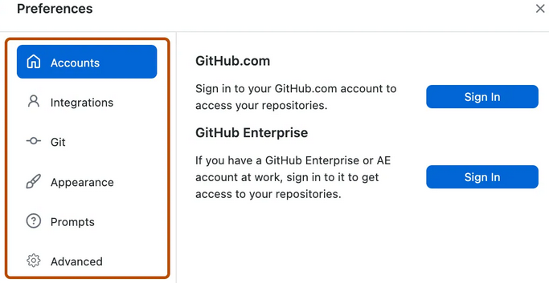
  

---

## :five: Créer un dépôt

* sélectionner `File` dans la barre de menus > `New repository...`

* nommez le dépôt, donnez-lui une description est cliquez sur `Create repository`

* le dépôt est créé sur votre ordinateur dans le répertoire indiqué dans le champ `Local path` (p. ex. `/home/ljudmila/Documents/GitHub`)

  

    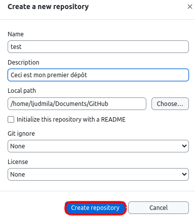
  

---

### Retrouver le dépôt créé en local

* après avoir créé le dépôt, trouvez le répôt sur votre ordinateur en suivant le chemin correspondant

  

    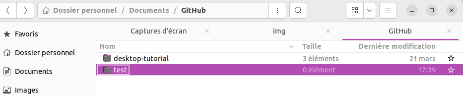
  

---

## :six: Ajouter un fichier : créer une documentation en Markdown

* ouvrez un fichier Markdown (`.md`) avec un éditeur Markdown (p. ex. [Typora](https://typora.io/))
* utilisez l'en-tête 1 pour écrire « Ma première documentation en Markdown », suivi d'un paragraphe contenant le mot « Coucou »
* sauvegarder le fichier sous le nom `README.md` (pour que son contenu soit visible sur la page d'accueil du dépôt créé)

  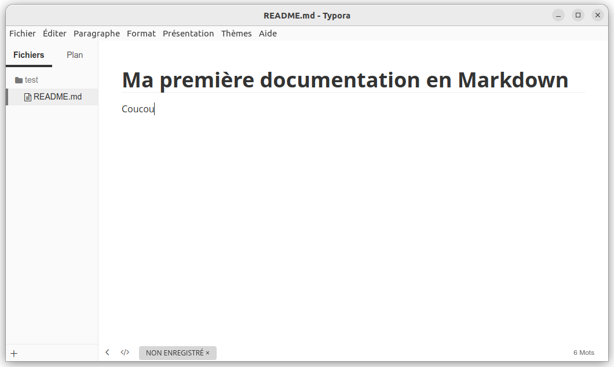

---

### Observer les modifications effectuées dans GitHub Desktop

* revenez sur GitHub Desktop et observer les modifications effectuées dans le fichier `README.md`

  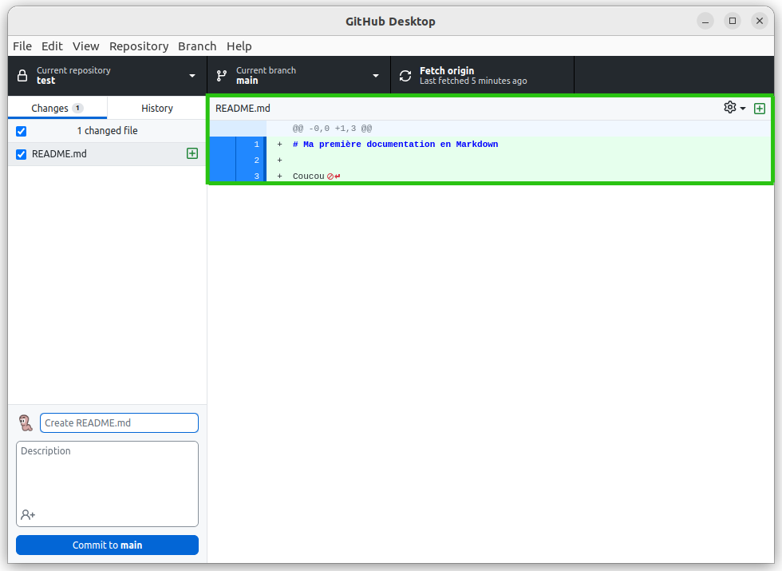

---

## :seven: *Commiter* vos modifications

* dans le champ dédié à l'écriture des commits, écrivez : « créé une documentation » et cliquez sur le bouton `Commit to main`

  

    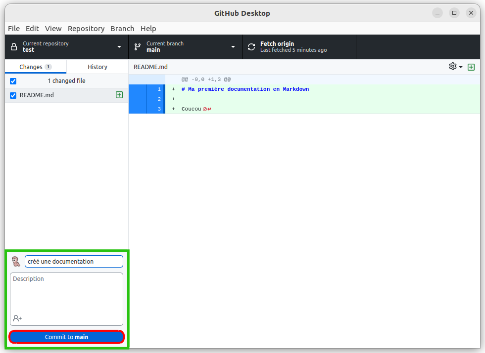
  

---

## :eight: *Pusher* vos modifications

* pour publier vos modifications sur GitHub, cliquez sur `Push origin` ou `Repository > Push`

  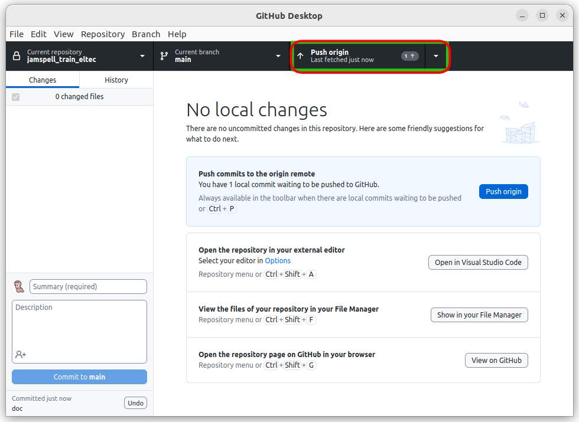

---

### Votre dépôt distant sur GitHub

* retrouvez votre dépôt créé dans la liste des dépôts dans votre compte GitHub

  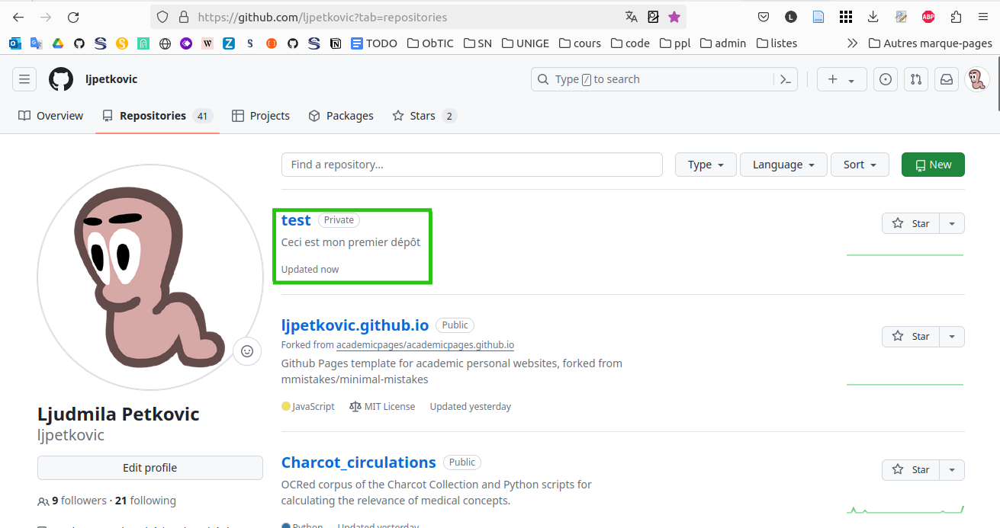      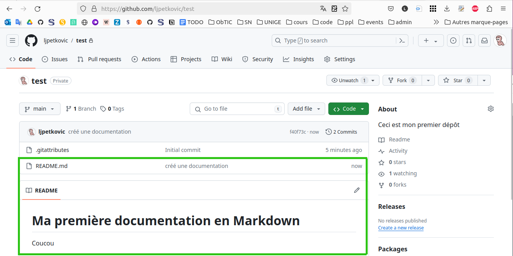

---

## Cloner un dépôt distant

* cliquez sur `File` > `Clone repository`

* dans l'onglet `URL` `Repository URL or GitHub username and repository` saisissez le lien URL suivant `https://github.com/ljpetkovic/depot_CNA` 

* le `Local path` spécifie l'adresse où `depot_CNA` sera hébergé (ne pas changer)

  

    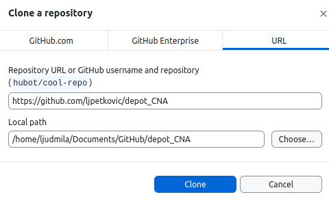
  

---

## État du dépôt cloné

* vous avez désormais accès au dépôt que vous venez de cloner

  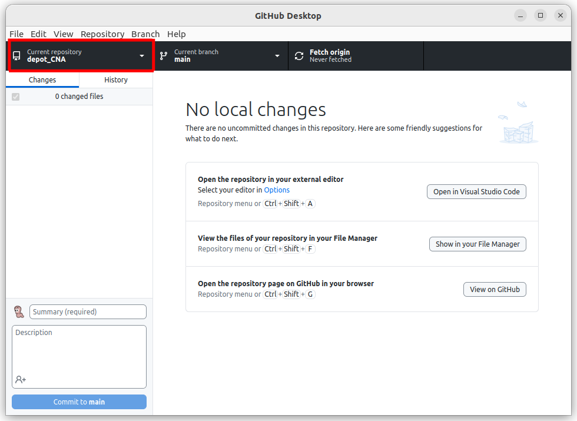

---

  ## Références

<ul style="font-size: 20px">
        <li><b>GitHub, Inc.</b>. (2024). <a href="https://docs.github.com/fr/desktop/overview/getting-started-with-github-desktop"><i>Bien démarrer avec GitHub Desktop</a></i>. Documentation GitHub.</li>
    <li><b>O'clock.</b> (2023, juillet 13). <a href="https://oclock.io/tuto-github-lutiliser">Tuto GitHub : comment l’utiliser ?</a>.</li>
    <li><b>Office québécois de la langue française</b>. (2002). <a href="https://archive.wikiwix.com/cache/index2.php?url=https%3A%2F%2Fvitrinelinguistique.oqlf.gouv.qc.ca%2Fredirection%2Fficheuid%2F8362923#federation=archive.wikiwix.com&tab=url">code source libre</a>. Dans <i>Office québécois de la langue française</i>. Consulté le 28 mars 2024.</li>

</ul>

