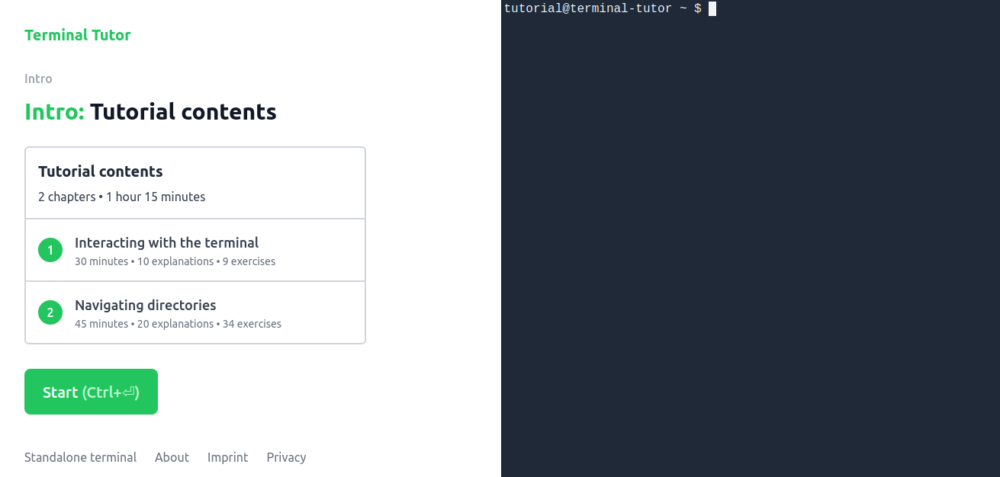
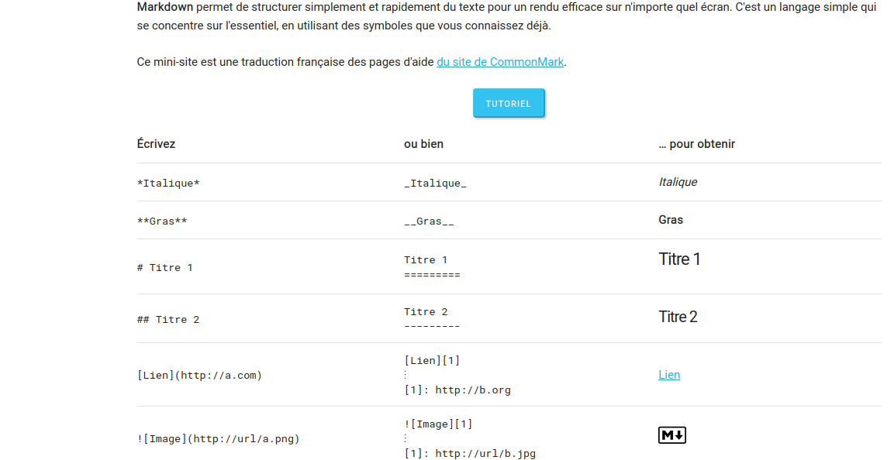
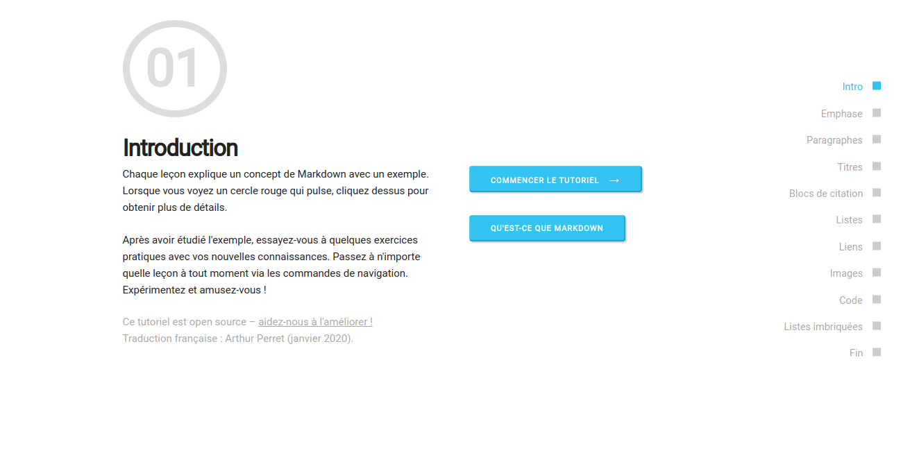
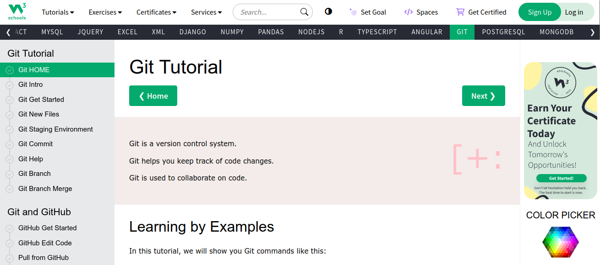
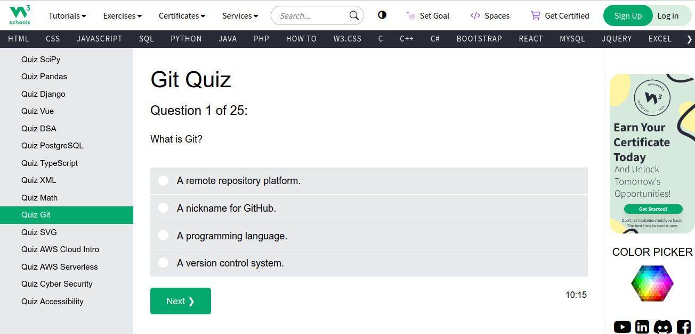
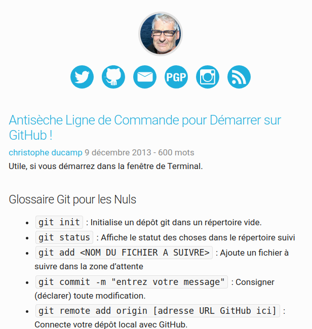

  

 

  

    
  

 

  

      <figure>
    
      </figure>
  

  <!-- _class: lead -->

  ## Cultures numériques avancées

  #### Exercices Bash, Markdown et Git

  ###### Ljudmila PETKOVIC

<small-text><a href="mailto:ljudmila.petkovic@sorbonne-nouvelle.fr">`ljudmila.petkovic@sorbonne-nouvelle.fr`</a></small-text>

   

  

  <small-text> 

Cultures numériques avancées (L2HN001)
Licence *Sciences du langage*, mineure « Humanités numériques »
Paris, le 5 avril 2024, année 2023-2024

  </small-text>

<!--<smaller-text>*Diapositives adaptées de l'[IUT Lyon 1](https://perso.liris.cnrs.fr/pierre-antoine.champin/enseignement/intro-git/)* *et de [Thibault Clérice](https://github.com/PonteIneptique/cours-git)*</smaller-text>-->

  Source :  <a href="https://kinsta.com/fr/blog/commandes-linux/">Diaz, 2023.</a>

---

# Bash

---

## [Terminal Tutor](https://www.terminaltutor.com/)

  

Aperçu de l'interface en ligne de commande sur le site Terminal Tutor.

---

# Markdown

---

## [Tutoriel Markdown](https://www.arthurperret.fr/tutomd/) (Perret, 2020)

  

Page d'accueil du tutoriel Markdown.

---

## [Tutoriel Markdown](https://www.arthurperret.fr/tutomd/tutorial/tutorial.html) (Perret, 2020)

  

Introduction au tutoriel Markdown.

---

# Git

---

## [Tutoriel Git](https://www.w3schools.com/git/default.asp?remote=github) 

  

Page d'accueil du tutoriel Git.

---

## [Exercices Git](https://www.w3schools.com/git/exercise.asp?filename=exercise_getstarted1) 

Exercices indispensables pour ce cours :

* *Git Get Started* : exercices 1-2
* *Git New Files* : exercice 1
* *Git Staging Environment* : exercice 1
* *Git Commit* : exercices 1, 4
* *Git Branch* : exercices 1-4
* *Git Remote Get Started* : exercice 1
* *Git Push to Remote* : exercice 1
* *Git Clone* : exercice 1-2
* *Git Reset* : exercice 1

---

## [Quiz sur Git](https://www.w3schools.com/quiztest/quiztest.asp?qtest=GIT)

* questions indispensables pour ce cours : 1-3, 7-13, 15-18, 22, 24
* questions avancées : 4-6, 14, 19-21, 23, 25

  

Début du quiz sur Git.

---

## [Récapitulatif des commandes utiles pour Bash et Git](https://christopheducamp.com/2013/12/09/anti-seche-ligne-de-commande/) (Ducamp, 2013)

  

Page d'accueil du récapitulatif des commandes utiles pour Bash et Git.

---

## [Tutoriel Git pratique](https://www.hostinger.fr/tutoriels/tuto-git) (Anonyme, 2023)

Utiliser Git en ligne de commande.

  

Page d'accueil du tutoriel pour la prise en main de Git.

---

  ## Références

<ul style="font-size: 20px">
        <li><b>Anonyme.</b> Tuto GIT Guide Complet Pour une Prise en Main Rapide !. Hostinger tutoriels. <a href="https://www.hostinger.fr/tutoriels/tuto-git">https://www.hostinger.fr/tutoriels/tuto-git</a></li>
    <li><b>Ducamp, C.</b> (2013). Antisèche Ligne de commande pour Démarrer sur GitHub ! <a href="https://www.christopheducamp.com/2013/12/09/anti-seche-ligne-de-commande/">https://www.christopheducamp.com/2013/12/09/anti-seche-ligne-de-commande/</a></li>
    <li><b>Perret, A.</b> (2020). Tutoriel Markdown. <a href="https://www.arthurperret.fr/tutomd/">https://www.arthurperret.fr/tutomd/</a></li>
    <li><b>Terminal Tutor.</b> (<i>s. d.</i>). Terminal Tutor – learn the Command Line interactively. <a href="https://www.terminaltutor.com/">https://www.terminaltutor.com/</a></li>
    <li><b>W3Cschools.</b> (2023). Git Tutorial. <a href="https://www.w3schools.com/git/">https://www.w3schools.com/git/</a></li>

</ul>

